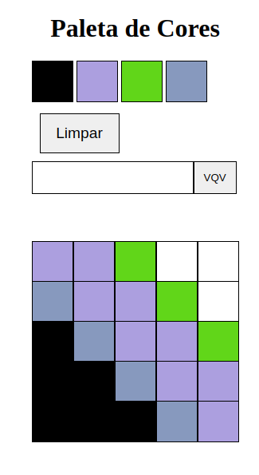

<h1 align="center" >Pixels Art</h1>

<h2 align="center">Descrição</h2>

Este projeto consiste em um editor de arte com pixels, onde o usuário pode pintar e criar desenhos utilizando uma paleta de cores funcional.

<h2 align="center">Habilidades Desenvolvidas</h2>

No desenvolvimento deste projeto foram utilizadas as seguintes habilidades

<ul>
  <li>JavaScript</li>
  <li>HTML</li>
  <li>CSS</li>
</ul>

<h2 align="center">📁 Acesso à aplicação</h2>

Você pode utilizar a aplicação clicando no link abaixo

<a href='https://jorge-case-pixels-art.netlify.app/'>Clique aqui para utilizar</a>

<h4 align="center">Este projeto é um dos requisitos para a formação de Desenvolvimento Web da Trybe</h4>

O projeto constava de <b>nove</b> requisitos obrigatórios e <b>três</b> requisitos optativos. Onde obtive <b>100% de aprovação</b>

  
Listagem de requisitos obrigatórios

<ul>
  <li>Adicione à página o título "Paleta de Cores".</li>
  <li>Adicione à página uma paleta contendo quatro cores distintas.</li>
  <li>Adicione a cor preta como a primeira cor da paleta de cores.</li>
  <li>Adicione à página um quadro de pixels com 25 pixels.</li>
  <li>Cada pixel do quadro deve possuir 40 pixels de largura, 40 pixels de altura e ser delimitado por uma borda preta de 1 pixel.</li>
  <li>Defina a cor preta como cor inicial.</li>
  <li>Clicar em uma das cores da paleta faz com que ela seja selecionada e utilizada para preencher os pixels no quadro.</li>
  <li>Clicar em um pixel dentro do quadro após selecionar uma cor na paleta faz com que o pixel seja preenchido com a cor selecionada.</li>
  <li>Crie um botão que, ao ser clicado, limpa o quadro preenchendo a cor de todos os seus pixels com branco.</li>
</ul>

Requisitos Bônus

<ul>
  <li>Faça o quadro de pixels ter seu tamanho definido pela pessoa usuária.</li>
  <li>Limite o tamanho mínimo e máximo do quadro.</li>
  <li>Faça com que as cores da paleta sejam geradas aleatoriamente ao carregar a página.</li>
</ul>

<h4 align="center">Para mais informações sobre a formação de Desenvolvimento Web da Trybe, clique no link abaixo</h4>
<a href='https://www.betrybe.com/'>Curso de Desenvolvimento Web Trybe</a>